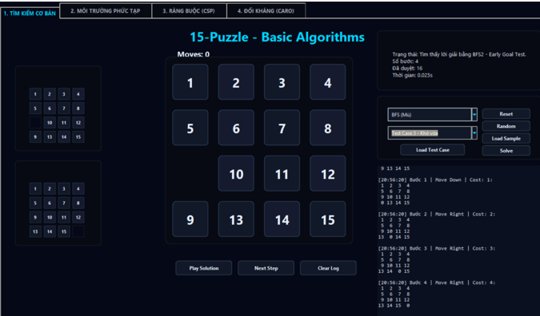

# 15-Puzzle AI - Trực quan hóa thuật toán tìm kiếm

## 0. Chạy nhanh

Dự án mô phỏng bài toán **15-Puzzle** bằng giao diện desktop Python/Tkinter, cho phép người dùng tương tác trực tiếp với bàn cờ 4x4, chọn thuật toán, chạy lời giải tự động, xem từng bước di chuyển và theo dõi log quá trình tìm kiếm.

Ngoài nhóm thuật toán giải 15-Puzzle cơ bản, chương trình còn có các tab minh họa thêm cho **môi trường phức tạp**, **bài toán thỏa mãn ràng buộc (CSP)** và **tìm kiếm đối kháng qua Caro 3x3**.

### 0.1. File chạy chính

```bash
python main.py
```

### 0.2. Thư viện cần thiết

Dự án chỉ dùng Python standard library, chủ yếu là `tkinter`, `ttk`, `collections`, `heapq`, `time`, `random` và `math`.

Trên Windows, `tkinter` thường đi kèm khi cài Python. Nếu máy thiếu `tkinter`, hãy cài lại Python bản có Tcl/Tk.

### 0.3. Ảnh giao diện chính



### 0.4. GIF minh họa thuật toán

Các GIF demo được đặt trong thư mục `GIF/` và được trình bày theo nhóm chức năng của chương trình.

<table border="1" cellspacing="0" cellpadding="8">
  <thead>
    <tr>
      <th>Nhóm</th>
      <th>Thuật toán / Kịch bản</th>
      <th>Demo</th>
    </tr>
  </thead>
  <tbody>
    <tr>
      <td><b>Tìm kiếm cơ bản</b></td>
      <td><b>BFS</b></td>
      <td align="center"></td>
    </tr>
    <tr>
      <td><b>Tìm kiếm cơ bản</b></td>
      <td><b>DFS</b></td>
      <td align="center"></td>
    </tr>
    <tr>
      <td><b>Tìm kiếm cơ bản</b></td>
      <td><b>A* Search</b></td>
      <td align="center"></td>
    </tr>
    <tr>
      <td><b>Tìm kiếm cơ bản</b></td>
      <td><b>Greedy Search</b></td>
      <td align="center"></td>
    </tr>
    <tr>
      <td><b>Tìm kiếm cơ bản</b></td>
      <td><b>Hill Climbing</b></td>
      <td align="center"></td>
    </tr>
    <tr>
      <td><b>Tìm kiếm cơ bản</b></td>
      <td><b>Local Beam Search</b></td>
      <td align="center"></td>
    </tr>
    <tr>
      <td><b>Môi trường phức tạp</b></td>
      <td><b>No Start</b></td>
      <td align="center"></td>
    </tr>
    <tr>
      <td><b>Môi trường phức tạp</b></td>
      <td><b>No Goal</b></td>
      <td align="center"></td>
    </tr>
    <tr>
      <td><b>Ràng buộc (CSP)</b></td>
      <td><b>Backtracking</b></td>
      <td align="center"></td>
    </tr>
    <tr>
      <td><b>Ràng buộc (CSP)</b></td>
      <td><b>Forward Checking</b></td>
      <td align="center"></td>
    </tr>
    <tr>
      <td><b>Đối kháng (Caro)</b></td>
      <td><b>Minimax</b></td>
      <td align="center"></td>
    </tr>
    <tr>
      <td><b>Đối kháng (Caro)</b></td>
      <td><b>Alpha-Beta Pruning</b></td>
      <td align="center"></td>
    </tr>
  </tbody>
</table>

---

## 1. Thông tin dự án

| Mục | Nội dung |
|---|---|
| Tên dự án | 15-Puzzle AI |
| Chủ đề | Trực quan hóa thuật toán tìm kiếm trong Trí tuệ nhân tạo |
| Ngôn ngữ | Python |
| Giao diện | Tkinter, ttk, Canvas |
| Bài toán chính | 15-Puzzle trên bàn cờ 4x4 |
| Ô trống | Biểu diễn bằng số `0` |
| Trạng thái đích | `(1, 2, 3, 4, 5, 6, 7, 8, 9, 10, 11, 12, 13, 14, 15, 0)` |
| File chạy chính | `main.py` |
| File giao diện | `ui/app.py` |
| File lõi bài toán | `core/puzzle.py`, `core/utils.py` |
| File thuật toán | Thư mục `algorithms/` |

---

## 2. Mục tiêu dự án

Dự án được xây dựng để hỗ trợ học và trình bày các nhóm thuật toán trong môn Trí tuệ nhân tạo thông qua một giao diện trực quan.

Các mục tiêu chính:

1. Mô phỏng bài toán 15-Puzzle với bàn cờ 4x4, 15 ô số và 1 ô trống.
2. Cho phép người dùng tự di chuyển ô, random trạng thái, load test case và giải tự động.
3. Cài đặt và so sánh nhiều nhóm thuật toán tìm kiếm: tìm kiếm mù, tìm kiếm có thông tin, tìm kiếm cục bộ.
4. Minh họa các kịch bản môi trường phức tạp như không biết trạng thái bắt đầu hoặc không biết rõ trạng thái đích.
5. Minh họa CSP bằng Backtracking và Forward Checking.
6. Minh họa tìm kiếm đối kháng bằng Minimax và Alpha-Beta Pruning trên Caro 3x3.
7. Hiển thị log chi tiết gồm trạng thái, số bước, số node đã duyệt, thời gian chạy và từng bước lời giải.

---

## 3. Bài toán 15-Puzzle

15-Puzzle là bài toán tìm kiếm trong không gian trạng thái. Mỗi trạng thái là một hoán vị của 16 giá trị:

```text
1  2  3  4
5  6  7  8
9 10 11 12
13 14 15 0
```

Trong đó:

| Thành phần | Ý nghĩa |
|---|---|
| `1` đến `15` | Các ô số có thể trượt |
| `0` | Ô trống |
| Start State | Trạng thái ban đầu cần giải |
| Goal State | Trạng thái đích chuẩn |
| Hành động | Di chuyển ô trống lên, xuống, trái hoặc phải bằng cách hoán đổi với ô kề cạnh |

Một trạng thái mới được sinh ra bằng cách trượt một ô số nằm cạnh ô trống. Trong chương trình, hàm `get_neighbors_with_actions()` trả về các trạng thái kế tiếp kèm tên bước đi như `Move Up`, `Move Down`, `Move Left`, `Move Right`.

---

## 4. Cấu trúc thư mục

```text
15_Puzzle/
├── main.py
│   └── Điểm vào chương trình, khởi tạo PuzzleApp.
├── README.md
│   └── Tài liệu mô tả dự án.
├── core/
│   ├── puzzle.py
│   │   └── Biểu diễn trạng thái, kiểm tra nước đi, sinh trạng thái kề, random trạng thái hợp lệ.
│   └── utils.py
│       └── Hàm tiện ích định dạng thời gian.
├── ui/
│   └── app.py
│       └── Giao diện Tkinter, 4 tab chức năng, render bàn cờ, điều khiển thuật toán và log.
├── algorithms/
│   ├── bfs.py
│   ├── dfs.py
│   ├── astar.py
│   ├── greedy.py
│   ├── beam_search.py
│   ├── hill_climbing.py
│   ├── no_start.py
│   ├── no_goal.py
│   ├── backtracking.py
│   ├── forward_checking.py
│   └── tic_tac_toe.py
└── GIF/
    └── Ảnh giao diện và GIF demo thuật toán dùng trong README.
```

---

## 5. Giao diện chương trình

Giao diện gồm 4 tab chính:

| Tab | Tên hiển thị | Vai trò |
|---|---|---|
| 1 | Tìm kiếm cơ bản | Giải 15-Puzzle bằng BFS, DFS, A*, Greedy, Local Beam, Hill Climbing |
| 2 | Môi trường phức tạp | Chạy kịch bản No Start và No Goal |
| 3 | Ràng buộc (CSP) | Minh họa gán số thỏa ràng buộc bằng Backtracking và Forward Checking |
| 4 | Đối kháng (Caro) | Minh họa Minimax và Alpha-Beta Pruning trên bàn Caro 3x3 |

### 5.1. Tab Tìm kiếm cơ bản

Tab này là phần chính của bài toán 15-Puzzle.

Chức năng:

- Hiển thị Start State và Goal State ở dạng mini board.
- Hiển thị bàn cờ chính 4x4.
- Click trực tiếp vào ô cạnh ô trống để di chuyển thủ công.
- Chọn thuật toán bằng combobox.
- Chọn test case: dễ, trung bình, khó vừa.
- Reset về Goal State.
- Random trạng thái bằng cách xáo từ Goal State để đảm bảo trạng thái có lời giải.
- Load sample gần Goal.
- Solve để chạy thuật toán.
- Play Solution để mô phỏng toàn bộ lời giải.
- Next Step để xem từng bước.
- Clear Log để xóa log.

### 5.2. Tab Môi trường phức tạp

Tab này mô phỏng các tình huống agent không có đầy đủ thông tin ban đầu.

| Kịch bản | Ý nghĩa |
|---|---|
| No Start | Không biết sẵn Start State. Chương trình sinh 2 Start State ngẫu nhiên, chạy Greedy Search và chọn kết quả tốt hơn. |
| No Goal | Không biết chính xác Goal State. Chương trình sinh 2 Goal State ngẫu nhiên và dùng BFS để tìm một goal đạt được. |

### 5.3. Tab Ràng buộc (CSP)

Tab CSP minh họa bài toán gán giá trị cho 16 ô:

- 15 ô đầu nhận giá trị từ `1` đến `15`.
- Ô cuối cùng mặc định là `0`.
- Các giá trị không được trùng nhau.
- Dãy giá trị phải tăng dần theo thứ tự ô.

Chương trình hỗ trợ:

- Backtracking.
- Forward Checking.
- Animation quá trình thử gán, cập nhật miền giá trị và quay lui.
- Log chi tiết từng bước suy luận.

### 5.4. Tab Đối kháng (Caro)

Tab này không phải bài toán 15-Puzzle, mà là phần mở rộng để minh họa tìm kiếm đối kháng.

Người chơi đánh `X`, AI đánh `O` trên bàn Caro 3x3. AI có thể chọn:

- Minimax thuần túy.
- Alpha-Beta Pruning.

Log sẽ hiển thị các nước AI thử, điểm đánh giá và nước đi được chọn.

---

## 6. Danh sách thuật toán đã cài đặt

### 6.1. Nhóm tìm kiếm cơ bản cho 15-Puzzle

| Thuật toán | File | Ý tưởng chính | Ghi chú |
|---|---|---|---|
| BFS | `algorithms/bfs.py` | Duyệt theo chiều rộng bằng hàng đợi FIFO | Dùng BFS2 - Early Goal Test |
| DFS | `algorithms/dfs.py` | Duyệt theo chiều sâu bằng stack LIFO | Có Early Goal Test |
| A* Search | `algorithms/astar.py` | Ưu tiên `f(n) = g(n) + h(n)` | Heuristic là tổng Manhattan Distance |
| Greedy Search | `algorithms/greedy.py` | Ưu tiên trạng thái có `h(n)` nhỏ nhất | Nhanh nhưng không đảm bảo tối ưu |
| Local Beam Search | `algorithms/beam_search.py` | Giữ `k` trạng thái tốt nhất mỗi vòng | Mặc định `k = 2` |
| Hill Climbing | `algorithms/hill_climbing.py` | Chọn hàng xóm tốt nhất nếu cải thiện heuristic | Có thể kẹt tại local optimum |

### 6.2. Nhóm môi trường phức tạp

| Kịch bản | File | Cách xử lý |
|---|---|---|
| No Start | `algorithms/no_start.py` | Sinh 2 Start State hợp lệ, chạy Greedy cho từng start, chọn lời giải tốt hơn |
| No Goal | `algorithms/no_goal.py` | Sinh 2 Goal State hợp lệ, dùng BFS tìm đường đến một trong các goal |

### 6.3. Nhóm CSP

| Thuật toán | File | Cách xử lý |
|---|---|---|
| Backtracking | `algorithms/backtracking.py` | Thử gán từng ô, kiểm tra ràng buộc AllDiff và tăng dần |
| Forward Checking | `algorithms/forward_checking.py` | Sau mỗi lần gán, cập nhật miền giá trị của các biến tương lai để cắt nhánh sớm |

Trong giao diện, tab CSP có tracer nội bộ để ghi lại từng bước gán, cập nhật domain và quay lui, giúp dễ quan sát hơn so với chỉ trả về kết quả cuối.

### 6.4. Nhóm tìm kiếm đối kháng

| Thuật toán | File | Cách xử lý |
|---|---|---|
| Minimax | `algorithms/tic_tac_toe.py` | Duyệt cây trò chơi, AI tối đa hóa điểm, người chơi tối thiểu hóa điểm |
| Alpha-Beta Pruning | `algorithms/tic_tac_toe.py` | Giữ kết quả của Minimax nhưng cắt bỏ các nhánh không cần xét |

---

## 7. Cách sử dụng

### 7.1. Chạy chương trình

Mở terminal tại thư mục dự án và chạy:

```bash
python main.py
```

### 7.2. Giải 15-Puzzle

1. Chọn tab `1. TÌM KIẾM CƠ BẢN`.
2. Chọn thuật toán trong combobox.
3. Chọn test case hoặc bấm `Random`, `Load Sample`.
4. Bấm `Solve`.
5. Xem kết quả ở panel bên phải.
6. Dùng `Play Solution` hoặc `Next Step` để mô phỏng lời giải.

### 7.3. Di chuyển thủ công

Người dùng có thể click vào một ô số nằm cạnh ô trống. Nếu nước đi hợp lệ, ô đó sẽ trượt vào vị trí ô trống và bộ đếm `Moves` tăng lên.

### 7.4. Chạy kịch bản phức tạp

1. Chọn tab `2. MÔI TRƯỜNG PHỨC TẠP`.
2. Chọn `No Start` hoặc `No Goal`.
3. Bấm `Chạy Kịch Bản`.
4. Quan sát Start State, Goal State, bàn cờ chính và log.

### 7.5. Giải CSP

1. Chọn tab `3. RÀNG BUỘC (CSP)`.
2. Chọn `Backtracking (CSP)` hoặc `Forward Checking (FC)`.
3. Bấm `Giải CSP`.
4. Quan sát quá trình gán số và quay lui trên animation.

### 7.6. Chơi Caro với AI

1. Chọn tab `4. ĐỐI KHÁNG (CARO)`.
2. Chọn `Minimax` hoặc `Alpha-Beta Pruning`.
3. Click vào ô trống để đánh `X`.
4. AI tự đánh `O` và ghi log đánh giá từng nước.

---

## 8. Định dạng kết quả thuật toán

Các thuật toán giải 15-Puzzle trả về kết quả dạng dictionary với các trường chính:

| Trường | Ý nghĩa |
|---|---|
| `path` | Danh sách trạng thái từ Start đến Goal |
| `moves` | Danh sách hành động tương ứng |
| `steps` | Số bước của lời giải |
| `visited` | Số trạng thái hoặc node đã duyệt |
| `time` | Thời gian chạy |
| `success` | Thuật toán có tìm được lời giải hay không |
| `message` | Thông báo kết quả hiển thị trên giao diện |

Trên giao diện, log sẽ in chi tiết từng bước:

```text
Bước 1 | Move Down | Cost: 1
1  2  3  4
5  6  7  8
9 10 11 12
0 13 14 15
```

---

## 9. So sánh các nhóm thuật toán

| Nhóm | Ưu điểm | Hạn chế | Phù hợp để minh họa |
|---|---|---|---|
| BFS | Tìm lời giải ngắn nhất nếu chi phí mỗi bước bằng nhau | Tốn bộ nhớ khi trạng thái xa goal | Tìm kiếm mù, hàng đợi FIFO, Early Goal Test |
| DFS | Đơn giản, dùng ít bộ nhớ hơn BFS | Không đảm bảo tối ưu, dễ đi sâu vào nhánh dài | Stack LIFO và khác biệt so với BFS |
| A* | Cân bằng chi phí đã đi và heuristic | Phụ thuộc chất lượng heuristic, có thể tốn bộ nhớ | Tìm kiếm có thông tin tối ưu |
| Greedy | Nhanh, dễ hiểu | Chỉ nhìn heuristic, không đảm bảo đường đi ngắn nhất | Tác dụng và giới hạn của heuristic |
| Local Beam | Duy trì nhiều ứng viên tốt cùng lúc | Có thể loại mất nhánh tốt nếu beam nhỏ | Tìm kiếm cục bộ theo chùm trạng thái |
| Hill Climbing | Rất trực quan, chọn bước cải thiện tốt nhất | Dễ kẹt local optimum hoặc plateau | Hạn chế của tìm kiếm cục bộ |
| No Start / No Goal | Mô phỏng thiếu thông tin ban đầu | Mang tính kịch bản, phụ thuộc trạng thái sinh ngẫu nhiên | Môi trường phức tạp và bất định |
| CSP | Thể hiện rõ ràng ràng buộc, miền giá trị, quay lui | Không phải solver 15-Puzzle đường đi | Backtracking, Forward Checking, constraint propagation |
| Minimax / Alpha-Beta | Ra quyết định khi có đối thủ | Không áp dụng trực tiếp cho 15-Puzzle một người chơi | Game tree và cắt tỉa alpha-beta |

---

## 10. Ghi chú kỹ thuật

- `shuffle_state()` tạo trạng thái ngẫu nhiên bằng cách đi từ Goal State qua nhiều nước hợp lệ, vì vậy trạng thái sinh ra luôn có thể giải được.
- Các thuật toán tìm kiếm chính dùng giới hạn `MAX_VISITED = 50000` để tránh treo giao diện khi trạng thái quá xa goal.
- Heuristic của A*, Greedy, Hill Climbing và Local Beam là tổng Manhattan Distance của các ô so với vị trí đích.
- Bàn cờ được biểu diễn bằng tuple 16 phần tử để dễ hash, lưu trong `set`, `dict`, priority queue và parent map.
- Giao diện dùng kích thước cố định `1350x850`, nền tối, các ô được vẽ bằng Tkinter Canvas.

---

## 11. Kiểm tra nhanh

Có thể kiểm tra lỗi cú pháp bằng lệnh:

```bash
python -m py_compile main.py ui\app.py core\puzzle.py core\utils.py algorithms\bfs.py algorithms\dfs.py algorithms\astar.py algorithms\greedy.py algorithms\beam_search.py algorithms\hill_climbing.py algorithms\no_start.py algorithms\no_goal.py algorithms\backtracking.py algorithms\forward_checking.py algorithms\tic_tac_toe.py
```

Nếu muốn chạy chương trình, dùng:

```bash
python main.py
```

---

## 12. Kết luận

Dự án **15-Puzzle AI** là một ứng dụng trực quan phục vụ học tập và thuyết trình các thuật toán trong Trí tuệ nhân tạo. Phần chính của chương trình tập trung vào giải 15-Puzzle bằng nhiều chiến lược tìm kiếm khác nhau, từ BFS/DFS đến A*, Greedy và tìm kiếm cục bộ.

Bên cạnh đó, các tab No Start/No Goal, CSP và Caro giúp mở rộng phạm vi minh họa sang những chủ đề quan trọng khác của AI như môi trường thiếu thông tin, thỏa mãn ràng buộc, quay lui, kiểm tra miền giá trị, game tree và cắt tỉa alpha-beta.

Nhờ có giao diện, animation, log từng bước và GIF demo, project phù hợp để demo trên lớp, viết báo cáo đồ án và giải thích sự khác nhau giữa các nhóm thuật toán một cách trực quan.
